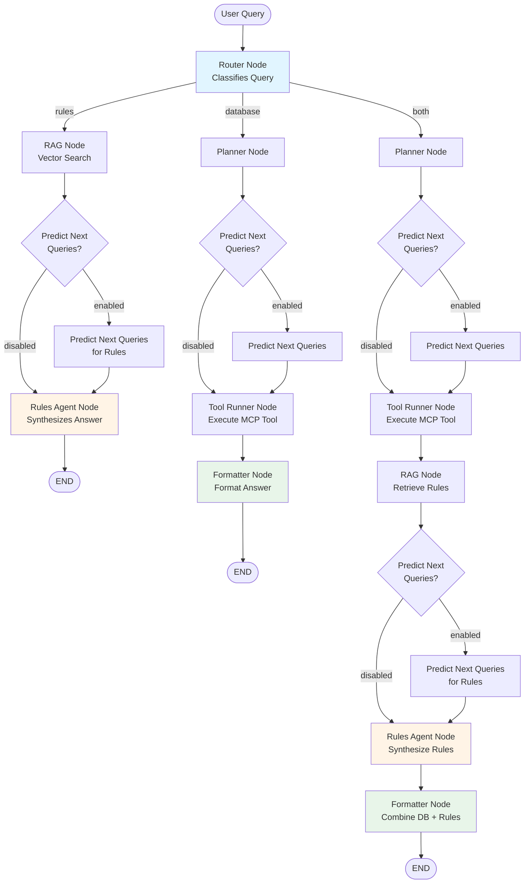
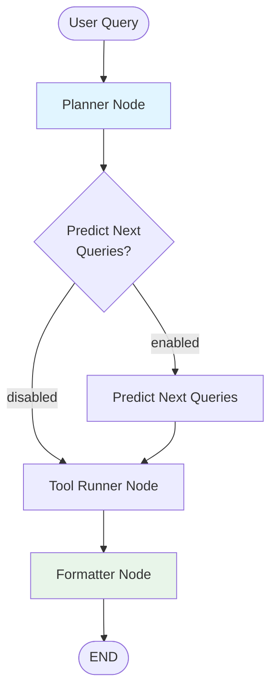

# Aviation Agent – Design & Architecture Guide

This document describes the architecture, components, and design principles for the aviation-focused LangGraph agent that uses the custom **aviation MCP database** (routes, airports, rules) and exposes **structured outputs** suitable for a modern chat UI (including side panels such as maps, airport cards, or rules checklists).

## UI Payload Design (Hybrid Approach)

The agent implements a **hybrid UI payload design**:

- The UI receives a **stable, curated JSON payload (`ui_payload`)**
- It contains:
  - `kind`: `"route"`, `"airport"`, or `"rules"`
  - A small set of stable **top-level fields** (e.g. `departure`, `icao`, `region`)
  - **Flattened commonly-used fields** for convenience (`filters`, `visualization`, `airports`)
  - A **full MCP tool output** stored under the key:
    ```
    "mcp_raw": { ... }
    ```

- Internally, the agent's planner (`AviationPlan`) is **decoupled** from the UI.
- Only the `build_ui_payload(plan, tool_result)` function must be updated if planner output evolves.

This design strongly isolates UI from internal LLM schema changes while still enabling rich UI behavior and convenient access to common fields.

---

## 1. High-Level Architecture

### Core Design

The agent uses a **routing-based architecture** that intelligently directs queries to the appropriate path:

1. **Router Node** (optional, configurable)
   - LLM-based query classification
   - Routes to: `"rules"`, `"database"`, or `"both"` paths
   - Extracts relevant countries from query

2. **Rules Path** (for regulations questions)
   - **RAG Node**: Retrieves relevant rules using vector search
   - **Next Query Predictor** (optional): Generates follow-up suggestions
   - **Rules Agent Node**: Synthesizes natural language answer from retrieved rules
   - Returns answer with `show_rules` UI payload

3. **Database Path** (for airport/route queries)
   - **Planner Node**: LLM with structured output (`AviationPlan`)
     - Selects one aviation tool
     - Extracts arguments (including filters)
     - Specifies answer style
   - **Next Query Predictor** (optional): Generates follow-up suggestions based on plan
   - **Tool Runner Node**: Executes the chosen MCP-backed LangChain tool
   - **Formatter Node**: Produces final answer and UI payload

4. **Both Path** (combines database + rules)
   - Executes database path first
   - Then adds rules via RAG + Rules Agent
   - Formatter combines both results

### Agent State Flow

**With Routing Enabled:**



**Without Routing (Backward Compatible):**



**Note:** Next Query Prediction nodes are conditionally included in the graph based on the `enable_next_query_prediction` setting in the behavior config. When disabled, the graph skips these nodes and flows directly to the next step.

The UI receives (via SSE streaming):

- `answer` (markdown, streamed character-by-character)
- `ui_payload` (stable JSON with hybrid structure)
- `thinking` (combined planning + formatting reasoning)
- `plan` (full plan for debugging)
- Token usage statistics

---

## 2. Repository Structure

The agent follows FlyFun's pattern of separating shared Python libraries (`shared/`), FastAPI server code (`web/server/`), and pytest suites (`tests/`).

```
shared/aviation_agent/
  __init__.py
  config.py                # Settings + behavior config loading
  behavior_config.py        # JSON config schema (Pydantic)
  state.py
  planning.py
  execution.py
  formatting.py
  graph.py                  # Graph construction with routing
  routing.py                # Query router (rules vs database)
  rules_rag.py              # RAG system for rules retrieval
  rules_agent.py            # Rules synthesis agent
  next_query_predictor.py   # Follow-up query suggestions
  adapters/
    __init__.py
    streaming.py          # SSE streaming adapter
    logging.py            # Conversation logging
    langgraph_runner.py   # Orchestration helpers
```

```
web/server/api/
  aviation_agent_chat.py  # FastAPI router with streaming endpoint
```

```
tests/aviation_agent/
  __init__.py
  conftest.py             # Shared fixtures + MCP doubles
  test_planning.py
  test_execution.py
  test_formatting.py
  test_graph_e2e.py
  test_streaming.py
  test_integration.py
```

### Placement Notes

- `shared/aviation_agent/` keeps the LangGraph stack versioned once and importable from both the web server and any offline scripts.
- The FastAPI router in `web/server/api/aviation_agent_chat.py` is mounted by `web/server/main.py` with feature flag support (`AVIATION_AGENT_ENABLED`).
- Tests live under `tests/aviation_agent/` and follow the repo's pytest discovery pattern.

---

## 3. Web/API Integration

### Router (`web/server/api/aviation_agent_chat.py`)

The FastAPI router:
- Validates chat requests (messages, session IDs).
- Instantiates the agent graph via `build_agent()`.
- Provides streaming endpoint (`/chat/stream`) using SSE.
- Provides non-streaming endpoint (`/chat`) for simple requests.
- Handles conversation logging after execution.
- Returns structured responses with `answer`, `ui_payload`, and metadata.

### Server Integration

The router is included in `web/server/main.py`:

```python
if aviation_agent_chat.feature_enabled():
    app.include_router(
        aviation_agent_chat.router,
        prefix="/api/aviation-agent",
        tags=["aviation-agent"],
    )
```

### Configuration

The agent uses a **two-tier configuration system** with a clear separation of concerns:

#### Configuration Guidelines

**The key question: "Does this change how the agent thinks, or where data goes?"**

| Category | Location | Examples |
|----------|----------|----------|
| **Behavior** (how the agent thinks) | JSON config files | LLM models, temperatures, prompts, routing logic, RAG parameters |
| **Infrastructure** (where data goes) | Environment variables | Database paths, API keys, storage locations, feature flags |

#### Environment Variables (`shared/aviation_agent/config.py`)

Infrastructure and deployment settings that vary between environments:

| Variable | Description |
|----------|-------------|
| `AVIATION_AGENT_ENABLED` | Feature flag for router inclusion |
| `AVIATION_AGENT_CONFIG` | Name of behavior config file (default: `"default"`) |
| `VECTOR_DB_PATH` / `VECTOR_DB_URL` | ChromaDB location |
| `CHECKPOINTER_PROVIDER` | Conversation memory backend: `memory`, `sqlite`, `none` |
| `CHECKPOINTER_SQLITE_PATH` | Path to SQLite database for checkpointer |
| `AIRPORTS_DB` | Path to airports database |
| `RULES_JSON` | Path to rules JSON file |
| `COHERE_API_KEY` | For reranking (if using Cohere) |
| `OPENAI_API_KEY` | For LLMs and embeddings |

#### Behavior Configuration (JSON files in `configs/aviation_agent/`)

Agent behavior settings that affect how the agent thinks and acts:

- **LLM Settings**: Models, temperatures, streaming per component (planner, formatter, router, rules)
- **Feature Flags**: Routing, query reformulation, reranking, next query prediction
- **RAG Settings**: Embedding model, retrieval parameters (top_k, similarity_threshold)
- **Reranking Settings**: Provider (cohere/openai/none), model selection
- **Prompts**: File paths to system prompts (planner, formatter, rules_agent, router)

#### Why This Separation?

- **Checkpointer** is in `.env` because it determines WHERE conversation state is stored (memory vs SQLite), not HOW the agent behaves. The same agent logic works identically with any storage backend.
- **LLM models** are in JSON config because they directly affect HOW the agent thinks and responds.
- **Database paths** are in `.env` because they're deployment-specific and may contain sensitive information.

See `designs/AVIATION_AGENT_CONFIGURATION_ANALYSIS.md` for complete configuration documentation.

---

## 4. Testing Strategy

### Unit Tests

- `test_planning.py` - Planner filter extraction, tool selection
- `test_execution.py` - Tool runner execution
- `test_formatting.py` - UI payload building, visualization enhancement
- `test_state_and_thinking.py` - State management, thinking combination

### Integration Tests

- `test_graph_e2e.py` - Full graph execution
- `test_streaming.py` - SSE event streaming
- `test_integration.py` - FastAPI router integration via TestClient

### Test Fixtures

- Re-use `tests/tools` fixtures for MCP responses
- MCP doubles for isolated testing
- Contract tests that assert `ui_payload` schema stability

---

## 5. Planner Schema & Tool Naming

### Tool Selection

- `AviationPlan.selected_tool` uses the literal MCP tool names defined in `shared/airport_tools.get_shared_tool_specs()` (e.g., `search_airports`, `find_airports_near_route`, `get_airport_details`, `list_rules_for_country`, …).
- Validation in `shared/aviation_agent/planning.py` ensures planner references only tools that exist in the manifest.
- `build_ui_payload()` maps these literal tool names to the three UI `kind` buckets (`route`, `airport`, `rules`).

### Filter Extraction

- Planner extracts user requirements (AVGAS, customs, runway length, country, etc.) into `plan.arguments.filters`.
- Filters are part of tool arguments, not a separate field.
- Tools return `filter_profile` in results, which UI can use for filter synchronization.

---

## 6. Agent State

```python
class AgentState(TypedDict, total=False):
    messages: Annotated[List[BaseMessage], operator.add]

    # Routing
    router_decision: Optional[RouterDecision]  # Routing decision (rules/database/both)

    # Rules path
    retrieved_rules: Optional[List[dict]]  # Rules from RAG retrieval
    rules_answer: Optional[str]  # Synthesized answer from rules agent
    rules_sources: Optional[List[dict]]  # Source links from rules

    # Database path
    plan: Optional[AviationPlan]
    planning_reasoning: Optional[str]  # Planner's reasoning
    tool_result: Optional[Any]

    # Output
    formatting_reasoning: Optional[str]  # Formatter's reasoning
    final_answer: Optional[str]  # User-facing response text
    thinking: Optional[str]  # Combined reasoning for UI
    ui_payload: Optional[dict]  # Stable UI structure (hybrid approach)
    error: Optional[str]  # Error message if execution fails

    # User preferences
    persona_id: Optional[str]  # Persona ID for airport prioritization

    # Next query prediction
    suggested_queries: Optional[List[dict]]  # Follow-up query suggestions
```

### State Fields

- **`messages`**: Conversation history (uses `Annotated[List[BaseMessage], operator.add]` for automatic accumulation)
- **`router_decision`**: Routing decision with path (`rules`/`database`/`both`), confidence, countries
- **`retrieved_rules`**: Rules retrieved via RAG (rules path)
- **`rules_answer`**: Synthesized answer from rules agent (rules path)
- **`rules_sources`**: Source links from rules
- **`plan`**: Structured plan from planner node (database path)
- **`planning_reasoning`**: Why the planner selected this tool/approach
- **`tool_result`**: Raw result from tool execution (database path)
- **`formatting_reasoning`**: How the formatter presents results
- **`final_answer`**: User-facing response text
- **`thinking`**: Combined reasoning (planning + formatting) for UI display
- **`ui_payload`**: Structured payload for UI integration
- **`error`**: Error message if execution fails
- **`persona_id`**: Persona ID for airport prioritization
- **`suggested_queries`**: Follow-up query suggestions (optional, configurable)

---

## 7. UI Payload Building (`build_ui_payload()`)

### Hybrid Approach

The UI payload uses a **hybrid design**:
- **Stable top-level keys** (`kind`, `departure`, `icao`, etc.)
- **Flattened commonly-used fields** (`filters`, `visualization`, `airports`) for convenience
- **Full MCP result** under `mcp_raw` as authoritative source

### Implementation

```python
def build_ui_payload(
    plan: AviationPlan,
    tool_result: dict | None,
    suggested_queries: List[dict] | None = None
) -> dict | None:
    """
    Builds UI payload with hybrid structure:
    - Determines kind (route/airport/rules) from tool name
    - Adds kind-specific metadata (departure, icao, region, etc.)
    - Flattens commonly-used fields (filters, visualization, airports)
    - Includes full mcp_raw as authoritative source
    - Adds suggested_queries if provided
    """
    # ... implementation ...

    # Returns:
    # {
    #     "kind": "route" | "airport" | "rules",
    #     "mcp_raw": {...},  # Full tool result
    #     "filters": {...},  # Flattened from mcp_raw.filter_profile
    #     "visualization": {...},  # Flattened from mcp_raw.visualization
    #     "airports": [...],  # Flattened from mcp_raw.airports
    #     "suggested_queries": [...],  # Optional
    #     # Plus kind-specific fields: departure, destination, icao, region, topic, etc.
    # }
```

### Why This Design?

- **Highly stable**: UI structure rarely changes (only `kind` and a few metadata fields at top level)
- **Convenient access**: Common fields (`filters`, `visualization`, `airports`) are flattened for easy UI access
- **Fully future-proof**: Planner can evolve without breaking UI (new fields automatically in `mcp_raw`)
- **Authoritative source**: `mcp_raw` contains complete tool result
- **No breaking changes**: UI can use either flattened fields or `mcp_raw`

---

## 8. Routing System

### Router Node

The router classifies queries into three paths:

- **`"rules"`**: Questions about regulations, procedures, requirements
- **`"database"`**: Questions about airports, routes, locations
- **`"both"`**: Questions that need both database results and relevant regulations

The router uses an LLM with structured output (`RouterDecision`) and extracts relevant countries from the query using:
- ICAO code prefixes (e.g., `LF` → France)
- Country name matching
- Airport ICAO codes mentioned in query

### Rules Path Flow

1. **RAG Node**: Retrieves relevant rules using vector search
   - Uses query reformulation (if enabled) for better matching
   - Applies reranking (Cohere or OpenAI) if enabled
   - Filters by countries from router decision

2. **Next Query Predictor** (optional): Generates follow-up suggestions
   - Rule-based suggestions based on query context
   - Considers countries mentioned

3. **Rules Agent Node**: Synthesizes answer from retrieved rules
   - Uses LLM to generate natural language explanation
   - Includes proper citations and source links
   - Returns `show_rules` UI payload for frontend display

### Database Path Flow

1. **Planner Node**: Selects tool and extracts arguments
2. **Next Query Predictor** (optional): Generates suggestions based on plan
3. **Tool Runner Node**: Executes MCP tool
4. **Formatter Node**: Formats answer and builds UI payload

### Both Path Flow

1. Executes database path (Planner → Tool → Formatter)
2. Then executes rules path (RAG → Rules Agent)
3. Formatter combines both results into final answer

---

## 9. Formatter Node

The formatter node produces both the final answer and the UI payload. It handles three scenarios:

1. **Database-only path**: Formats tool results
2. **Rules-only path**: Returns answer from rules agent (no formatting needed)
3. **Both path**: Combines database and rules answers

```python
def formatter_node(state: AgentState) -> Dict[str, Any]:
    """
    Formats final answer and builds UI payload. Handles three scenarios:
    1. Database-only: Formats tool results using LLM, builds UI payload, enhances visualization
    2. Rules-only: Returns empty dict (answer already in state from rules_agent_node)
    3. Both: Combines database and rules answers, builds UI payload
    """
    # ... implementation ...

    # Returns:
    # {
    #     "final_answer": str,  # Formatted markdown answer
    #     "thinking": str,  # Combined planning + formatting reasoning
    #     "ui_payload": dict | None,  # UI structure with kind, mcp_raw, etc.
    # }
```

**Note**: The formatter uses prompts loaded from the behavior config (`prompts/formatter_v1.md` by default).

---

## 10. Configuration System

### Behavior Configuration

All behavioral settings are controlled via JSON configuration files in `configs/aviation_agent/`:

- **LLM Configuration**: Models, temperatures, streaming per component
- **Feature Flags**: Routing, query reformulation, reranking, next query prediction
- **RAG Settings**: Embedding model, retrieval parameters
- **Reranking Settings**: Provider (cohere/openai/none), model selection
- **System Prompts**: File paths to prompt markdown files

### Prompt Loading

System prompts are stored as markdown files in `configs/aviation_agent/prompts/`:
- `planner_v1.md` - Planner system prompt
- `formatter_v1.md` - Formatter system prompt
- `rules_agent_v1.md` - Rules agent system prompt
- `router_v1.md` - Router system prompt

Prompts are loaded via `behavior_config.load_prompt(key)` which resolves paths relative to the config directory.

### LLM Resolution

LLMs are resolved in `langgraph_runner.py` with the following priority:
1. Explicitly passed LLM instance (for testing)
2. Model from behavior config (`behavior_config.llms.{component}.model`)
3. Environment variable override (`AVIATION_AGENT_{COMPONENT}_MODEL`)
4. Runtime error if none provided

Temperature and streaming settings come from the behavior config.

See `designs/AVIATION_AGENT_CONFIGURATION_ANALYSIS.md` for complete configuration documentation.

---

## 11. FastAPI Endpoint

### Streaming Endpoint

```python
@router.post("/chat/stream")
async def aviation_agent_chat_stream(
    request: ChatRequest,
    settings: AviationAgentSettings = Depends(get_settings),
    session_id: Optional[str] = None,
) -> StreamingResponse:
    """
    SSE streaming endpoint for chat requests.
    Builds agent graph, streams events (plan, thinking, message, ui_payload, done),
    and logs conversation after completion.
    """
    # ... implementation ...

    # Returns: StreamingResponse with SSE events
```

### Response Schema

**SSE Events:**
- `plan` - Planner output (selected tool, arguments)
- `thinking` - Planning reasoning
- `tool_call_start` - Tool execution started
- `tool_call_end` - Tool execution completed
- `message` - Character-by-character answer stream
- `ui_payload` - Visualization data
- `done` - Request complete (session_id, token counts)
- `error` - Error occurred

### UI Integration

The UI uses `ui_payload` to determine visualization:

- `"kind": "route"` → show route map with markers
- `"kind": "airport"` → show airport info card
- `"kind": "rules"` → show rules panel
- `mcp_raw` provides all underlying details for drawing polylines, markers, etc.
- Flattened fields (`filters`, `visualization`, `airports`) provide convenient access

---

## 12. MCP Tool & Payload Catalog

The shared code centralizes every MCP tool signature in `shared/airport_tools.py`. The agent treats that file as the single source of truth and uses `get_shared_tool_specs()` for planner validation.

### Tool Catalog

| Tool | Required args | Optional args | Default `ui_payload.kind` | Notable `mcp_raw` keys |
| --- | --- | --- | --- | --- |
| `search_airports` | `query` | `max_results`, `filters`, `priority_strategy` | `route` | `airports`, `filter_profile`, `visualization.type='markers'` |
| `find_airports_near_location` | `location_query` | `max_distance_nm`, `filters`, `priority_strategy` | `route` | `center`, `airports`, `filter_profile`, `visualization.type='point_with_markers'` |
| `find_airports_near_route` | `from_location`, `to_location` | `max_distance_nm`, `filters`, `priority_strategy` | `route` | `airports`, `filter_profile`, `visualization.type='route_with_markers'`, `substitutions` |
| `get_airport_details` | `icao_code` | – | `airport` | `airport`, `runways`, `visualization.type='marker_with_details'` |
| `get_border_crossing_airports` | – | `country` | `airport` | `airports`, `by_country`, `filter_profile`, `visualization.style='customs'` |
| `get_airport_statistics` | – | `country` | `airport` | `stats` |
| `get_airport_pricing` | `icao_code` | – | `airport` | `pricing`, `pretty` |
| `get_pilot_reviews` | `icao_code` | `limit` | `airport` | `reviews`, `average_rating` |
| `get_fuel_prices` | `icao_code` | – | `airport` | `fuels`, `pricing` |
| `list_rules_for_country` | `country_code` | `category`, `tags` | `rules` | `rules`, `formatted_text`, `categories` |
| `compare_rules_between_countries` | `country1`, `country2` | `category` | `rules` | `comparison`, `formatted_summary`, `total_differences` |
| `get_answers_for_questions` | `question_ids` | – | `rules` | `items`, `pretty` |
| `list_rule_categories_and_tags` | – | – | `rules` | `categories`, `tags`, `counts` |
| `list_rule_countries` | – | – | `rules` | `items`, `count` |

### Documentation Workflow

1. **Tool manifest** - Tools are defined in `shared/airport_tools.py` as the single source of truth.
2. **Planner alignment** - `AviationPlan.selected_tool` uses literal tool names from the manifest.
3. **UI payload mapping** - `build_ui_payload()` maps tool names to `kind` buckets.
4. **Payload stability** - The `Notable mcp_raw keys` column serves as a contract with the UI.

See `designs/UI_FILTER_STATE_DESIGN.md` for complete tool-to-visualization mapping and LLM integration details.

---

## 13. Design Benefits

### ✔ Stable for the UI
Only `kind`, `departure`, `icao`, etc. matter at the top level. UI structure rarely changes.

### ✔ Convenient Access
Commonly-used fields (`filters`, `visualization`, `airports`) are flattened for easy access.

### ✔ Internal Evolution is Painless
Planner and tool schemas can change freely. New fields automatically appear in `mcp_raw`.

### ✔ Full Richness Preserved
`mcp_raw` always contains everything from the tool result.

### ✔ Clean, Simple UI Dispatch
```typescript
switch(ui_payload.kind) {
  case "route":
    renderRoute(ui_payload.visualization || ui_payload.mcp_raw.visualization);
    break;
  case "airport":
    renderAirport(ui_payload.mcp_raw);
    break;
  case "rules":
    renderRules(ui_payload.mcp_raw);
    break;
}
```

---

## 14. Key Design Principles

### State-Based Thinking
- Reasoning stored in state fields (`planning_reasoning`, `formatting_reasoning`)
- Combined into `thinking` for UI display
- No tag parsing from LLM output

### Filters as Arguments
- Filters are part of `plan.arguments.filters`
- Tools return `filter_profile` (what was actually applied)
- UI gets filters from flattened `ui_payload.filters` or `ui_payload.mcp_raw.filter_profile`

### Error Handling in State
- Errors stored in state (`error` field)
- Formatter can produce error message even on failure
- Errors emitted as SSE events

### LangGraph-Native Patterns
- Uses `astream_events()` for streaming
- Uses state reducers (`operator.add` for messages)
- Errors propagate through state, not exceptions

---

## 15. Additional Features

### Next Query Prediction

The agent can generate follow-up query suggestions based on the current query and plan:
- **Database path**: Suggestions based on tool selected, filters applied, locations mentioned
- **Rules path**: Suggestions for related rule questions
- **Configuration**: Enabled via `next_query_prediction.enabled`, max suggestions via `max_suggestions`
- **UI Integration**: Suggestions included in `ui_payload.suggested_queries`

### Query Reformulation

For better RAG matching, queries can be reformulated before vector search:
- **Configuration**: Enabled via `query_reformulation.enabled`
- **Implementation**: Uses LLM to rewrite query for better semantic matching
- **Use Case**: "What are the customs requirements?" → "border crossing procedures customs clearance"

### Reranking

Retrieved rules can be reranked for better relevance:
- **Providers**: Cohere (specialized rerank models) or OpenAI (embedding similarity)
- **Configuration**: `reranking.provider` (`cohere`/`openai`/`none`)
- **Benefits**: Improves relevance of top results, especially for ambiguous queries

---

## 16. Architecture Quality & Best Practices

This section highlights the excellent architectural patterns and best practices implemented in the aviation agent, which serve as a reference for building robust LangGraph applications.

### 16.1 State Management Excellence

**Proper Use of LangGraph State Reducers:**
```python
class AgentState(TypedDict, total=False):
    messages: Annotated[List[BaseMessage], operator.add]
```
- Uses `Annotated[List[BaseMessage], operator.add]` for automatic message accumulation
- LangGraph automatically merges messages across node updates
- No manual list concatenation needed - cleaner, less error-prone

**Clean TypedDict with Partial Updates:**
```python
class AgentState(TypedDict, total=False):
    # total=False allows partial state updates
```
- `total=False` enables nodes to return partial state dictionaries
- Each node only returns the fields it modifies
- No need to pass entire state through - just the delta

**Clear Separation of Concerns:**
- Routing state: `router_decision`, `retrieved_rules`
- Planning state: `plan`, `planning_reasoning`, `tool_result`
- Output state: `final_answer`, `thinking`, `ui_payload`, `error`
- Each node owns specific state fields

### 16.2 RAG Implementation (Hybrid RAG Pattern)

**Query Reformulation via `QueryReformulator` Class:**
```python
class QueryReformulator:
    def reformulate(self, query: str, context: Optional[List[str]] = None) -> str:
        """Convert colloquial queries into formal aviation regulation questions."""
```
- Converts informal queries ("Where do I clear customs?") into formal questions
- Improves vector search quality significantly
- Lazy LLM initialization for testing without API keys
- Graceful fallback to original query if reformulation fails

**Multi-Provider Reranking Support:**
```python
# Cohere reranker (specialized rerank models)
class Reranker:
    def rerank(self, query: str, documents: List[Dict], top_k: int) -> List[Dict]:
        # Uses Cohere's rerank-v3.5 API

# OpenAI reranker (embedding-based similarity)
class OpenAIReranker:
    def rerank(self, query: str, documents: List[Dict], top_k: int) -> List[Dict]:
        # Uses cosine similarity between query and doc embeddings
```
- Cohere: Specialized cross-encoder models for maximum relevance
- OpenAI: Embedding similarity (no additional API cost)
- Configurable via `reranking.provider` setting
- Clean abstraction - easy to add new providers

**Smart Multi-Country Expansion via RulesManager:**
```python
# For multi-country queries:
# 1. Query vector DB globally (no country filter) to find best questions
# 2. Use RulesManager to expand those questions to all requested countries
```
- Ensures consistent questions across countries
- Avoids bias toward countries with more regulations in DB
- Clean separation: RAG finds questions, RulesManager provides answers

**Configurable Similarity Thresholds and top_k:**
```python
retrieval_config = RetrievalConfig(
    top_k=5,
    similarity_threshold=0.3,
    rerank_candidates_multiplier=2
)
```
- Similarity threshold filters low-quality matches
- `rerank_candidates_multiplier` controls how many candidates to rerank
- Balance between precision and recall

### 16.3 Structured Output (Best Practices)

**Using `with_structured_output(method="function_calling")`:**
```python
# Preferred method for OpenAI models
structured_llm = llm.with_structured_output(AviationPlan, method="function_calling")
```
- Uses function calling instead of strict JSON schema mode
- More reliable with conversation history (critical for multi-turn chats)
- No need for manual JSON parsing or PydanticOutputParser
- Native LangChain integration

**Fallback to `PydanticOutputParser` for Non-OpenAI Models:**
```python
if hasattr(llm, 'with_structured_output'):
    # Use native structured output
    structured_llm = llm.with_structured_output(AviationPlan, method="function_calling")
else:
    # Fallback to PydanticOutputParser
    parser = PydanticOutputParser(pydantic_object=AviationPlan)
```
- Graceful degradation for models without native structured output
- Single codebase works with multiple LLM providers
- Clear error messages when parsing fails

**Tool Validation Against Manifest:**
```python
def _validate_plan(plan: AviationPlan, tools: Sequence[AviationTool]) -> None:
    valid_names = {tool.name for tool in tools}
    if plan.selected_tool not in valid_names:
        raise ValueError(f"Tool '{plan.selected_tool}' not in manifest")
```
- Validates planner output against actual tool manifest
- Prevents hallucinated tool names
- Clear error messages for debugging

### 16.4 Streaming (LangGraph Best Practice)

**Using `astream_events(version="v2")`:**
```python
async for event in graph.astream_events(initial_state, version="v2"):
    kind = event.get("event")
    if kind == "on_chat_model_stream":
        # Stream LLM tokens character-by-character
    elif kind == "on_llm_end":
        # Extract token usage
```
- Uses LangGraph's recommended streaming API (`version="v2"`)
- Captures all events: node execution, LLM streaming, tool calls
- No manual event handling - LangGraph does it
- Works across all nodes in the graph

**Token Usage Tracking Across LLM Calls:**
```python
total_input_tokens = 0
total_output_tokens = 0

# Extract from on_llm_end events
if kind == "on_llm_end":
    usage = output.response_metadata.get("token_usage")
    total_input_tokens += usage.get("prompt_tokens", 0)
    total_output_tokens += usage.get("completion_tokens", 0)
```
- Aggregates token usage from all LLM calls (planner, formatter, router, rules)
- Returns total usage at end of stream
- Critical for cost tracking and monitoring

**SSE-Compatible Event Format:**
```python
yield {
    "event": "message",
    "data": {"content": chunk}
}
yield {
    "event": "done",
    "data": {"session_id": "...", "tokens": {...}}
}
```
- Standard SSE format: `event` and `data` fields
- UI can easily distinguish event types
- Compatible with EventSource API

### 16.5 Configuration Management Excellence

**Hierarchical Pydantic Models for Type Safety:**
```python
class AgentBehaviorConfig(BaseModel):
    llms: LLMsConfig
    routing: RoutingConfig
    rag: RAGConfig
    reranking: RerankingConfig
    # ...
```
- Nested Pydantic models enforce schema validation
- Type checking at development time (with mypy/pyright)
- Self-documenting configuration structure
- Validation errors show exact path to invalid field

**External JSON Configs with Prompt Files Separated:**
```
configs/aviation_agent/
  default.json          # Main config (models, flags, settings)
  prompts/
    planner_v1.md       # Planner system prompt
    formatter_v1.md     # Formatter system prompt
    router_v1.md        # Router system prompt
    rules_agent_v1.md   # Rules agent system prompt
```
- Configuration data separated from code
- Prompts in markdown for easy editing
- Versioned prompts (v1, v2, etc.)
- Non-technical users can modify prompts without code changes

**LRU Caching on Settings and Behavior Config:**
```python
@lru_cache(maxsize=1)
def get_settings() -> AviationAgentSettings:
    return AviationAgentSettings()

@lru_cache(maxsize=10)
def get_behavior_config(config_name: str) -> AgentBehaviorConfig:
    # Load from file and cache
```
- Settings loaded once and cached
- Multiple configs cached (useful for A/B testing)
- No repeated file I/O on every request
- FastAPI dependency injection compatible

**Clean Dependency Injection Pattern for Testability:**
```python
def build_planner_runnable(
    llm: Runnable,
    tools: Sequence[AviationTool],
    system_prompt: Optional[str] = None
) -> Runnable:
    # Accept LLM as parameter, not hardcoded
```
- All components accept LLM instances as parameters
- Tests can inject mock LLMs
- No environment variable dependencies in tests
- Clear boundaries between configuration and execution

### 16.6 Error Handling Excellence

**Try/Except in All Nodes with Graceful Fallbacks:**
```python
def router_node(state: AgentState) -> Dict[str, Any]:
    try:
        decision = router.route(query, conversation=messages)
        return {"router_decision": decision}
    except Exception as e:
        # Fallback to database path on error
        return {"router_decision": RouterDecision(
            path="database",
            confidence=0.5,
            reasoning=f"Router failed, defaulting to database: {e}"
        )}
```
- Every node has try/except
- Graceful degradation (router fails → default to database)
- Errors don't crash entire graph
- Reasoning explains fallback to user

**Error State Propagation Through Graph:**
```python
class AgentState(TypedDict, total=False):
    error: Optional[str]  # Error propagates through state

def tool_node(state: AgentState) -> Dict[str, Any]:
    if state.get("error"):
        return {}  # Skip execution if previous error
```
- Errors stored in state, not exceptions
- Downstream nodes check for errors
- Graph continues to completion (can still log, return partial results)
- Better than exception-based control flow

**Fallback Behaviors:**
```python
# Example: Router fails → default to database path
# Example: RAG retrieval fails → return empty list, not crash
# Example: Formatter fails → return error message as answer
```
- System stays operational even with component failures
- User always gets a response (even if it's an error message)
- Logging captures failures for debugging

### 16.7 Testing Excellence

**Comprehensive Test Suite:**
```
tests/aviation_agent/
  test_planning.py          # Unit: Planner filter extraction, validation
  test_execution.py         # Unit: Tool execution
  test_formatting.py        # Unit: UI payload building
  test_graph_e2e.py         # E2E: Full graph execution
  test_streaming.py         # E2E: SSE streaming
  test_integration.py       # Integration: FastAPI endpoint
```
- Unit tests for individual components
- E2E tests for full graph flows
- Integration tests for API layer
- Clear test organization

**Dependency Injection Enabling Mock LLMs:**
```python
# In tests:
mock_llm = FakeChatModel(responses=["mock response"])
planner = build_planner_runnable(llm=mock_llm, tools=tools)

# No API keys needed, fast tests
```
- All components accept LLM as parameter
- Tests use `FakeChatModel` from LangChain
- No API calls in tests (fast, no cost)
- Tests are deterministic

**Contract Tests for UI Payload Stability:**
```python
def test_ui_payload_structure():
    # Assert ui_payload has stable fields
    assert "kind" in payload
    assert "mcp_raw" in payload
    # Prevents accidental breaking changes
```
- Validates UI contract
- Catches breaking changes early
- Documents expectations

---

## Related Documents

- `designs/AVIATION_AGENT_CONFIGURATION_ANALYSIS.md` - Complete configuration system documentation
- `designs/CHATBOT_WEBUI_DESIGN.md` - WebUI integration and streaming details
- `designs/UI_FILTER_STATE_DESIGN.md` - Complete tool-to-visualization mapping
